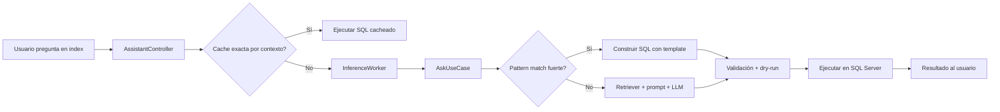

# VannaLight

Asistente industrial con IA para consultar datos operativos en lenguaje natural, administrar conocimiento contextual y preparar dominios de consulta sin depender de hardcodeo.

## Qué es

VannaLight es un piloto orientado a industria/manufactura que combina tres capacidades:

- **Text-to-SQL** para consultar bases operativas con lenguaje natural.
- **RAG de documentos** para responder usando contenido indexado.
- **Predicciones / forecasting** como capacidad complementaria.

Hoy, la estrella del proyecto es el flujo **Text-to-SQL**, con soporte para múltiples contextos de consulta y una interfaz administrativa para configurar:

- workspaces
- dominios
- conexiones
- objetos SQL permitidos
- reglas de negocio
- semantic hints
- query patterns

## Qué problema resuelve

En muchos entornos industriales, la información existe pero está fragmentada:

- una base operativa con KPIs y eventos
- documentos técnicos o de proceso
- usuarios que no escriben SQL

VannaLight busca cerrar esa brecha permitiendo que un usuario haga preguntas como:

- `¿Qué prensa lleva más scrap en el turno actual?`
- `¿Cuáles son los 5 números de parte con más scrap?`
- `Muéstrame 5 registros de Orders.`

y obtenga una respuesta usable sin navegar manualmente por tablas, vistas o reportes.

## Capacidades principales

### 1. Text-to-SQL

- recibe preguntas en lenguaje natural
- resuelve el contexto activo de consulta
- usa objetos permitidos, reglas, hints y ejemplos
- genera SQL para SQL Server
- valida el SQL antes de ejecutarlo
- soporta revisión administrativa y entrenamiento posterior

### 2. Administración contextual

La UI de administración permite preparar un dominio de consulta:

- crear o seleccionar un workspace
- asociarlo a una conexión
- descubrir schema
- seleccionar tablas permitidas
- inicializar schema docs y semantic hints
- validar preguntas reales

### 3. Exportación

Los resultados tabulares pueden exportarse a:

- `CSV`
- `PDF`

### 4. RAG de documentos

El sistema incluye una capacidad de ingestión y respuesta basada en documentos, útil como complemento del flujo principal.

### 5. Predicciones

Existe soporte para predicción/forecasting con ML.NET como capacidad adicional.

## Arquitectura

El proyecto sigue una estructura cercana a Clean Architecture:

- [VannaLight.Core](C:/Users/edggom/source/repos/malditokoala/VannaLight/VannaLight.Core)
  - dominio, contratos y casos de uso
- [VannaLight.Infrastructure](C:/Users/edggom/source/repos/malditokoala/VannaLight/VannaLight.Infrastructure)
  - SQLite, SQL Server, retrieval, validación y cliente LLM
- [VannaLight.Api](C:/Users/edggom/source/repos/malditokoala/VannaLight/VannaLight.Api)
  - API, SignalR, worker de inferencia y frontend web

## Flujo general de una pregunta



## Multi-contexto

VannaLight ya soporta múltiples contextos de consulta.

Un contexto se define por:

- `tenantKey`
- `domain`
- `connectionName`
- `systemProfileKey`

Esto permite que el usuario final seleccione una base/dominio y haga preguntas contra ese contexto específico sin depender de defaults globales.

## Interfaces

### Chat principal

- [index.html](C:/Users/edggom/source/repos/malditokoala/VannaLight/VannaLight.Api/wwwroot/index.html)

Permite:

- seleccionar el contexto activo
- preguntar en lenguaje natural
- ver resultado tabular o gráfico
- exportar resultados

### Administración

- [admin.html](C:/Users/edggom/source/repos/malditokoala/VannaLight/VannaLight.Api/wwwroot/admin.html)

Permite:

- onboarding de dominios
- configuración del sistema
- allowed objects
- business rules
- semantic hints
- query patterns
- revisión y entrenamiento de preguntas

## Almacenamiento

### Base de memoria

- [vanna_memory.db](C:/Users/edggom/source/repos/malditokoala/VannaLight/VannaLight.Api/Data/vanna_memory.db)

Guarda:

- perfiles de configuración
- conexiones
- tenants y dominios
- allowed objects
- business rules
- semantic hints
- schema docs
- training examples
- query patterns

### Base de runtime

- [vanna_runtime.db](C:/Users/edggom/source/repos/malditokoala/VannaLight/VannaLight.Api/Data/vanna_runtime.db)

Guarda:

- historial de preguntas
- jobs
- SQL generado
- resultados
- estados de revisión

## Cómo correrlo

### Requisitos

- .NET 10 SDK
- SQL Server accesible para el contexto que vayas a usar
- modelo LLM local configurado

### Ejecución

1. Configura las conexiones necesarias.
2. Levanta la API:

```powershell
dotnet run --project .\VannaLight.Api\VannaLight.Api.csproj
```

3. Abre:

- Chat: `https://localhost:7282/index.html`
- Admin: `https://localhost:7282/admin.html`

## Estado actual

El proyecto está en fase de **piloto funcional**.

### Ya validado

- onboarding multi-db
- cambio de contexto en runtime
- separación ERP / Northwind
- exportación CSV/PDF
- administración context-aware en las pantallas principales

### En curso

- fast path para preguntas verificadas
- cierre total de memoria por contexto
- validación final E2E del piloto

## Roadmap corto

### Cierre del piloto

- fast path para `TrainingExamples` verificados por contexto
- limpieza del histórico legado
- filtrado final del editor/historial por contexto
- pruebas E2E completas
- checklist operativo de release

### Siguientes features WOW aprobadas

- **Exploración guiada sobre la última respuesta**
- **Historial local Top 10 de consultas**

## Documentación adicional

- [MANUAL_TECNICO_VANNALIGHT.md](C:/Users/edggom/source/repos/malditokoala/VannaLight/MANUAL_TECNICO_VANNALIGHT.md)
- [AUDITORIA_TECNICA.md](C:/Users/edggom/source/repos/malditokoala/VannaLight/AUDITORIA_TECNICA.md)
- [BACKLOG.md](C:/Users/edggom/source/repos/malditokoala/VannaLight/BACKLOG.md)

## Nota

Este repositorio representa un piloto en evolución. La prioridad actual es consolidar el flujo Text-to-SQL y cerrar el soporte multi-contexto con una experiencia consistente para configuración, entrenamiento y consulta.
